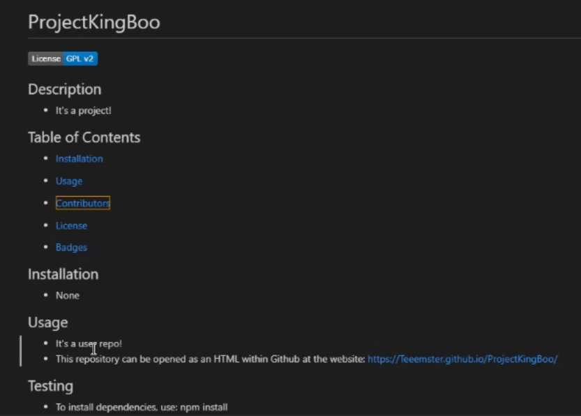

# README Generator

## Description
* This application generates a README.md file upon user input from the inquirer module.

## Table of Contents
* [Installation](#installation)

* [Usage](#usage)

* [Contributors](#contributors)

* [License](#license)

* [Badges](#badges)

## Installation
* To use this application, you must install the dependencies using npm install. 

## Usage
* The application can be invoked using node app.js. From here, the user will be prompted with a series of questions to fill out the README.md file.
* This repository can be opened as an HTML within Github at the website: https://github.com/Teeemster/README-Generator
* A video of the utility can be viewed here: https://watch.screencastify.com/v/Ssm697UwOoygOKONEzZB

## Testing
* To run tests, use: npm test.

## Contributors
* Jay Beach
* University of Arizonia

## License
* This application is covered under GPL v2.

## Badges

* 
